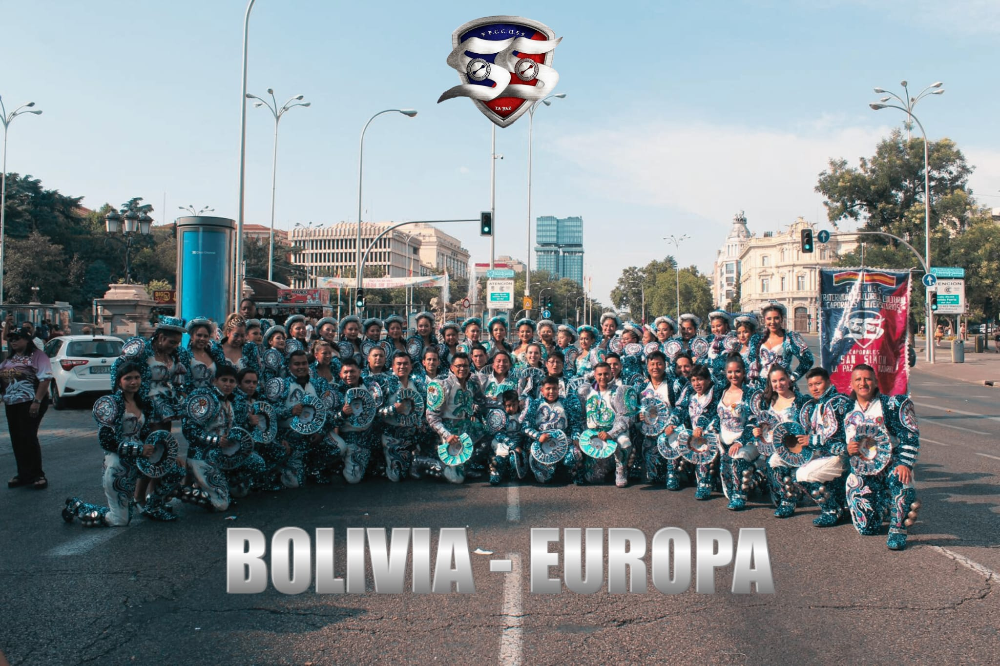

# sansimon_lapazmadrid
Asociación sin ánimo de lucro que preserva y difunde el folklore boliviano mediante la danza de los Caporales. Como filial oficial de la Fraternidad Folklórica y Cultural Caporales Universitarios San Simón La Paz en Madrid, promovemos la cultura, identidad y tradición con orgullo y compromiso.
# 🇧🇴 Caporales Universitarios San Simón La Paz - Filial Madrid

  

## ✨ Sobre nosotros
La **Fraternidad Folklórica y Cultural Caporales Universitarios San Simón** fue fundada en La Paz – Bolivia y hoy cuenta con presencia internacional.  
La **Filial Madrid**, creada por **José A. Zelada (Alex Guty)**, mantiene viva la tradición en Europa.  

Actualmente contamos también con filiales en:  
🇫🇷 París (Francia) | 🇪🇸 Bilbao y Barcelona (España)  

---

## 🌍 Nuestra misión
Preservar y difundir el **folklore boliviano** a través de la danza de los **Caporales**, transmitiendo cultura, identidad y orgullo a las nuevas generaciones.  

---

## 📸 Galería
Algunas presentaciones de nuestra filial Madrid:  

  
  

---

## 🔗 Enlaces oficiales
🌐 Página web (GitHub Pages):  
👉 [Caporales San Simón Madrid](https://TU-USUARIO.github.io/sansimon-madrid/)  

📱 Redes sociales:  
- [Facebook Filial Madrid](https://www.facebook.com/p/Caporales-San-Sim%C3%B3n-La-Paz-Madrid-100038549029816/?locale=es_LA)  

- [Facebook Universitarios Madrid](https://www.facebook.com/p/Caporales-Universitarios-San-Sim%C3%B3n-La-Paz-Madrid-100081003894603/)  
- [Instagram](https://www.instagram.com/sansimon_lapazmadrid/)  
- [TikTok](https://www.tiktok.com/@sansimonlapazmadrid)  
- [WhatsApp Directo](https://wa.me/34680778166)  

---

## 📞 Contacto
📍 Madrid – España  
📲 WhatsApp: **+34 680 778 166**

---

### © 2025 Caporales Universitarios San Simón La Paz – Filial Madrid
